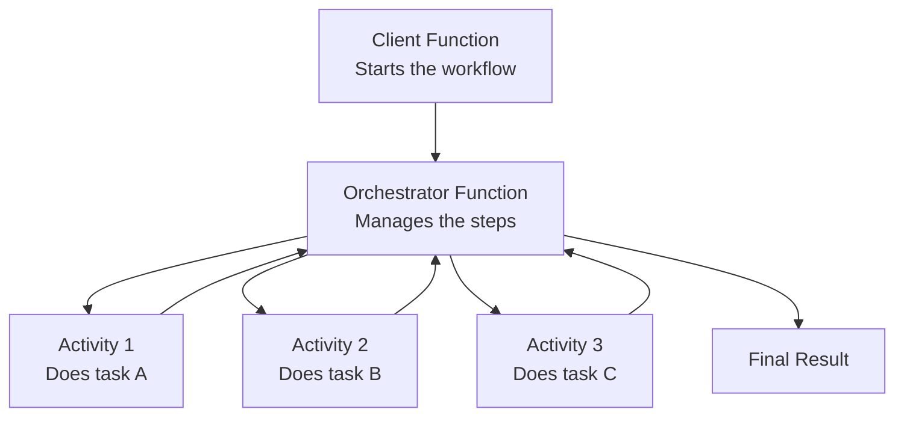

# CST8917 Assignment 1 - Serverless Computing Analysis

**Name:** Divyang Lodariya
**Student Number:** 041267824
**Course:** CST8917  

---

## Part 1: Paper Summary

The paper I read is called "Serverless Computing: One Step Forward, Two Steps Back," written by Hellerstein and others in 2019. The main point of this paper is simple: serverless computing is a great idea, but it has serious problems that make it hard to use in real applications.

So first, what is serverless? Basically, you write your code and upload it to the cloud. You don't manage any servers. The cloud runs your code only when someone calls it, and you only pay for that time. That sounds amazing, right? The paper agrees - it calls this the "one step forward" part.

But then the paper points out four big problems, which are the "two steps back" part.

**Problem 1 - Functions have a time limit.** On AWS Lambda, your function gets killed after 15 minutes no matter what. The paper tested this by training a machine learning model. On Lambda, it took 465 minutes and cost $0.29. The same job on a normal cloud server took 22 minutes and cost only $0.04. So Lambda was 21 times slower and 7 times more expensive. That is a huge difference.

**Problem 2 - Performance degrades as you scale.** One Lambda function gets about 538 Mbps of network speed. But when you run 20 functions at the same time, each one only gets 28.7 Mbps. So adding more functions actually makes each function slower. That is the opposite of what you want when scaling.

**Problem 3 - Functions cannot talk to each other directly.** This one is the biggest problem in the paper. Two serverless functions cannot call each other or share data. The only way they can communicate is by writing data to external storage like Amazon S3, and then the other function reads it from there. The paper measured this: direct network messaging takes 0.29 milliseconds. Going through S3 takes 108 milliseconds. That is 372 times slower. The paper calls this the "data-shipping anti-pattern." They also ran a test where 1000 Lambda functions tried to do a simple distributed task together. It took 16.7 seconds per round and would cost around $450 per hour. Completely impractical.

**Problem 4 - No special hardware.** Lambda only gives you CPU and a maximum of 3 GB of RAM. There is no GPU access at all. So if you need to run an AI model or any machine learning job that needs a GPU, serverless just cannot do it.

At the end, the paper suggests what future serverless platforms should look like. They want functions to be able to move to where the data is (instead of always moving data to the function), they want functions to stay alive and be reachable directly like a phone number, and they want support for GPUs and other hardware.

Overall, the paper is saying: serverless removes the pain of managing servers, which is great. But until these four problems are fixed, it is not ready for serious distributed computing work.

---

## Part 2: Azure Durable Functions - Deep Dive

### Topic 1: How Orchestrator, Activity, and Client Functions Work Together

Azure Durable Functions has three types of functions, and each one has a specific job. The **Client function** is the starting point. When you hit an API or trigger something, the client function runs first. Its only job is to start the workflow and then return immediately - it does not wait around.

The **Orchestrator function** is the manager. It decides what needs to happen and in what order. It calls the activity functions, waits for results, and then decides what to do next. The important thing is that the orchestrator never does any real work itself - it just coordinates.

The **Activity function** is the actual worker. It does the real tasks like reading a file, calling an API, or saving to a database.

Here is how they connect:

This structure directly solves the paper's concern about complex workflows. Instead of one function trying to do everything in 15 minutes, the work is split across multiple small activities that are managed by the orchestrator.

### Topic 2: How State Is Saved (Event Sourcing)

The paper said stateless functions are a problem because they forget everything between calls. Durable Functions fixes this using something called event sourcing. Every single step the orchestrator takes - calling an activity, getting a result, waiting for a timer - gets saved as an event in Azure Storage. Think of it like a logbook.

When the orchestrator needs to pause (for example, while waiting for a long task to finish), it saves its state and shuts down to save resources. When the activity is done, the orchestrator wakes up and reads the logbook to remember exactly where it was. This way it never loses its progress, even if it is shut down for hours or days. This directly fixes the paper's complaint about functions having no memory.

### Topic 3: How Durable Functions Get Around the Timeout Problem

Normal Azure Functions have a timeout. If your code runs too long, it gets killed. Durable Functions gets around this using a pattern called dehydrate and rehydrate. When the orchestrator is waiting for something - like waiting for an activity to finish - it saves its state and completely shuts itself down. It is not running, so the timeout clock never hits it. When the result comes back, the orchestrator starts up again, replays its history to remember where it was, and keeps going. This means a workflow can technically run for days or even weeks. The paper said the 15-minute timeout makes serverless useless for long tasks. Durable Functions basically removes that limit by making the function "sleep" instead of staying alive.

### Topic 4: How Functions Communicate Through the Task Hub

The paper showed that functions communicating through external storage (like S3) is 372 times slower than direct messaging. Durable Functions improves this using something called a Task Hub. Instead of ad-hoc file reads and writes, the orchestrator and activity functions talk through a structured queue in Azure Storage. When the orchestrator wants an activity to run, it puts a message in the queue. The activity picks it up, does its work, and puts the result back. The orchestrator then picks up the result and continues. It is still using storage underneath, so it is not fully peer-to-peer like the paper wanted. But it is much more organized and reliable compared to functions randomly reading and writing to S3. It also handles retries and errors automatically.

### Topic 5: Fan-Out / Fan-In 

Fan-out / fan-in is a pattern where you start multiple tasks at the same time and then collect all results at the end. Think of it like assigning the same homework assignment to 5 people at once - they all work on it together, and then you collect everyone's work at the end. In Azure Durable Functions, the orchestrator uses `Task.WhenAll()` to start multiple activity functions at the same time. All activities run in parallel. Once every single one of them finishes, the orchestrator collects all the results together and continues. This is exactly what the midterm project does - four different analysis tasks run at the same time on a PDF, and then the results are combined. The paper said serverless has no good way to coordinate parallel work. Durable Functions make this easy and built-in.

---

## Part 3: Critical Evaluation

Azure Durable Functions is genuinely a good answer to some of the paper's problems. The timeout problem is basically solved - orchestrators can sleep and wake up so they never hit the time limit. The statelessness problem is also solved - event sourcing saves progress after every step so nothing is ever lost. For workflows where you need to chain tasks together, wait for approvals, or run things in parallel, Durable Functions works really well.

But the paper raised four problems, and Durable Functions only really fixes two of them. Two problems are still there.

**Unsolved Problem 1 - Data still travels to the code, not the other way around.**

This was the biggest finding in the paper. Functions have to pull data from external storage and process it locally. The paper wanted cloud platforms to be smart enough to move the code to where the data already is, not drag data across the network to the function. Durable Functions did not change this. Activity functions still run on separate machines. If two activities need to share a large result - say a big JSON file or a parsed document - they still have to write it to Azure Blob Storage and pass a reference to each other. The communication is more organized than raw S3 reads and writes, but the data is still traveling over the network. The root problem the paper described is still happening.

**Unsolved Problem 2 - No GPU or special hardware.**

This one is completely untouched. Activity functions in Durable Functions run on the exact same compute as regular Azure Functions. There is no way to say "run this activity on a GPU." If someone wants to use Durable Functions for a machine learning pipeline and needs GPU acceleration at one step, they cannot do it natively. They would have to call an external service like Azure Machine Learning from inside an activity, which means leaving the Durable Functions system entirely for that step. The paper specifically said serverless needs to support specialized hardware. Durable Functions does not.

**Overall - did Durable Functions solve the paper's complaints?**

Honestly, yes and no. For the problems it focused on - timeouts, statelessness, long-running workflows - it did a really good job. Microsoft clearly looked at what developers were struggling with and built real solutions. For a student like me building my first cloud projects, Durable Functions feels like a genuinely useful tool.

But if I compare it to what the paper actually asked for - functions that can talk to each other directly with low latency, code that moves to where data lives, and GPU support,  then Durable Functions only went halfway. The paper wanted a rethinking of how serverless works at a deep level. Durable Functions is more like a very smart layer on top of the same old architecture. It covers up the problems without fully solving them underneath.

Still, I think for 2026, Durable Functions is one of the better serverless tools available, and it makes a lot of real-world use cases possible that were not practical before.

---

## References

1. Hellerstein, J. M., Faleiro, J., Gonzalez, J. E., Schleier-Smith, J., Sreekanti, V., Tumanov, A., & Wu, C. (2019). Serverless Computing: One Step Forward, Two Steps Back. CIDR 2019. https://arxiv.org/abs/1812.03651

2. Microsoft Learn. (2024). Azure Durable Functions overview. https://learn.microsoft.com/en-us/azure/azure-functions/durable/durable-functions-overview

3. Microsoft Learn. (2024). Durable Functions types and features. https://learn.microsoft.com/en-us/azure/azure-functions/durable/durable-functions-types-features-overview

---

## AI Disclosure

I used Claude (Anthropic AI) to help me understand the paper concepts and structure my writing. The ideas and understanding are my own - I made sure I understood each concept before writing about it. I take full responsibility for everything written above.
